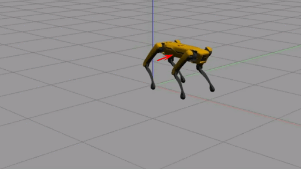
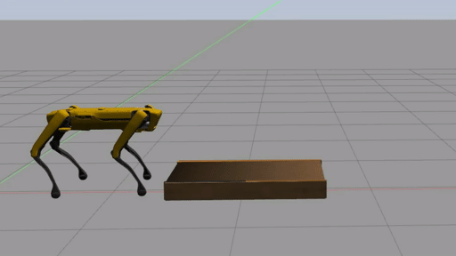
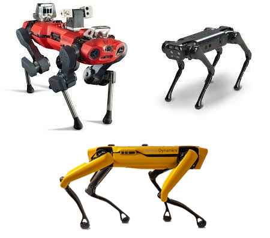

# WoLF: Whole-body Locomotion Framework for quadruped robots

<p align="center">
  
</p>

This repo contains the setup for the whole-body controller presented in the following [paper](https://hal.archives-ouvertes.fr/hal-03005133/document): 

```
@article{raiola2020simple,
  title={A simple yet effective whole-body locomotion framework for quadruped robots},
  author={Raiola, Gennaro and Mingo Hoffman, Enrico and Focchi, Michele and Tsagarakis, Nikos and Semini, Claudio},
  journal={Frontiers in Robotics and AI},
  volume={7},
  pages={159},
  year={2020},
  publisher={Frontiers}
}
```

## Features

WoLF provides several features for your quadruped robotic friend:


<center>

|  Push recovery |  Step reflex | Navigation ready  | Loco-manipulation  | Multi robot  |
|:-:|:-:|:-:|:-:|:-:|
|   |     |   |   |   |

</center>

## How to run WoLF

You can run it by installing the WoLF debian packages on your computer or by running WoLF inside a docker container. First, clone the repository with the following command:

`git clone https://github.com/graiola/wolf-setup.git`

### Docker container for Ubuntu 16.04 - 18.04 - 20.04

To download the image from [docker-hub](https://hub.docker.com/repository/docker/serger87/wolf) and launch WoLF within a docker container, run the following script:

`./run_docker.sh`

You can see what are the available options in the script with the following command:

`./run_docker.sh --help`

In case you don't have docker installed on your computer, you can run the following script:

`./support/install_docker.sh`

This script will install docker and its dependencies.

#### Notes:

- It could be necessary to restart the computer after running `install_docker.sh`.
- Use the `install_nvidia.sh` script in the `support` folder  if you are experiencing the following problem: `could not select device driver "" with capabilities: [[gpu]]`. 
- If you are experiencing this problem `nvidia-container-cli initialization error nvml error driver not loaded`, it probably means that your computer does not have the latest nvidia-drivers installed, so be sure that they are installed and updated to the last version.

### System installation for Ubuntu 18.04 - 20.04

To install the required dependencies (including ROS) and the WoLF debian packages run the following:

`./install.sh`

After the installation, update your bash enviroment with the following command:

`source ~/.bashrc`

#### How to start the controller

WoLF provides four interfaces to move the robot:

- A [PS3](docs/ps3.png) joypad interface: `roslaunch wolf_controller wolf_controller_bringup.launch input_device:=ps3`
- A [XBox](docs/xbox.jpeg) joypad interface: `roslaunch wolf_controller wolf_controller_bringup.launch input_device:=xbox`
- A [keyboard](docs/keyboard.png) interface: `roslaunch wolf_controller wolf_controller_bringup.launch input_device:=keyboard`
- A [spacemouse](docs/spacemouse.png) interface: `roslaunch wolf_controller wolf_controller_bringup.launch input_device:=spacemouse`

A twist topic is always active and listening for velocity commands on `/robot_name/wolf_controller/twist`. This topic can be used to send twist commands at a lower priority than the above mentioned interfaces.
It can also be used to send `move_base` commands if you want  to integrate WoLF with the ROS navigation stack (see [wolf_navigation](https://github.com/graiola/wolf_navigation) for an example).
To make the robot stand up, press the `start` button on the joypad or press the `enter` key if you are using the keyboard.

## How to add a new robot

If you want to test a different quadruped robot check out [wolf_descriptions](https://github.com/graiola/wolf_descriptions).

## Legal notes

- `wolf-setup` is distributed and licensed under a license GNU General Public License v3.0.
- `wolf-controller` is licensed under a [license]("http://creativecommons.org/licenses/by-nc-nd/4.0/") Creative Commons Attribution-NonCommercial-NoDerivatives 4.0 International License</a>.

- For the other packages please check the respective `LICENSE` document.
