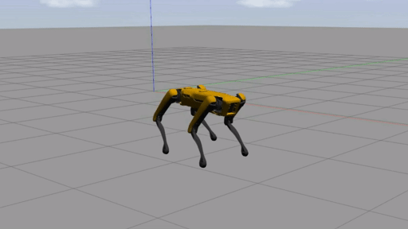
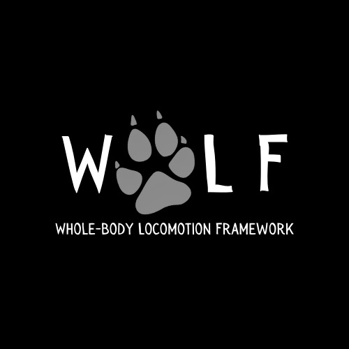
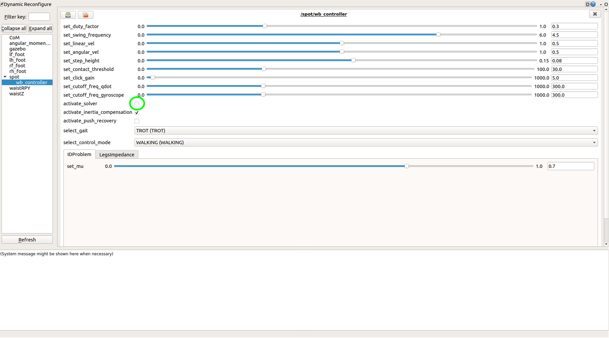

# WoLF: Whole-body Locomotion Framework for quadruped robots

<p float="center">
   
  
  
</p>

This repo contains the debian packages of the whole-body controller presented in the following [paper](https://hal.archives-ouvertes.fr/hal-03005133/document): 

```
@article{raiola2020simple,
  title={A simple yet effective whole-body locomotion framework for quadruped robots},
  author={Raiola, Gennaro and Mingo Hoffman, Enrico and Focchi, Michele and Tsagarakis, Nikos and Semini, Claudio},
  journal={Frontiers in Robotics and AI},
  volume={7},
  pages={159},
  year={2020},
  publisher={Frontiers}
}
```

If you or your organization are interested in the source code, please send an email to gennaro.raiola(AT)gmail.com

## How to run the controller

You can run the controller by installing it on your computer or by running it in a docker container. First be sure to clone the repo:

`git clone https://github.com/graiola/wolf-setup.git`

### Docker container for Ubuntu 16.04 - 18.04 - 20.04

To download the image from [docker-hub](https://hub.docker.com/repository/docker/serger87/wolf) and launch the controller within a docker container, run the following script:

`./run_docker.sh`

Use the help argument to see what are the available options:

`./run_docker.sh --help`

If you need to install docker on your computer, you can run the following:

`./support/install_docker.sh`

#### Notes:

- It could be necessary to restart the computer after  installing docker with `install_docker.sh`.
- Use the `install_nvidia.sh` script in the `support` folder  if you are experiencing the following problem: `could not select device driver "" with capabilities: [[gpu]]`. 
- If you are experiencing this problem `nvidia-container-cli initialization error nvml error driver not loaded`, it probably means that your computer does not have the latest nvidia-drivers installed. Be sure that they are installed and updated.

### System installation for Ubuntu 18.04 - 20.04

To install the required dependencies (including ROS) and the WoLF debian packages for Ubuntu 18.04 run the following:

`./install.sh`

After the installation, update your bash enviroment:

`source ~/.bashrc`

#### How to start the controller

WoLF provides four possible ways to move the robot around:

- With a [PS3](docs/ps3.png) joypad: `roslaunch wolf_controller wolf_controller_bringup.launch input_device:=ps3`
- With a [XBox](docs/xbox.jpeg) joypad: `roslaunch wolf_controller wolf_controller_bringup.launch input_device:=xbox`
- With the [keyboard](docs/keyboard.png): `roslaunch wolf_controller wolf_controller_bringup.launch input_device:=keyboard`
- With a dedicated ROS topic: `roslaunch wolf_controller wolf_controller_bringup.launch input_device:=twist`

With this last option it is possible to send twist commands by publishing to the topic `/robot_name/wolf_controller/twist`.

If you are using a joypad, press the `start` button when ready, otherwise use the gui as reported in the image below:

<p align="center"> 

</p>

## How to add a new robot

If you are interested in testing a different quadruped robot check out this [repository](https://github.com/graiola/wolf_descriptions).

## Legal notes

This work is licensed under a [license]("http://creativecommons.org/licenses/by-nc-nd/4.0/") Creative Commons Attribution-NonCommercial-NoDerivatives 4.0 International License</a>.

